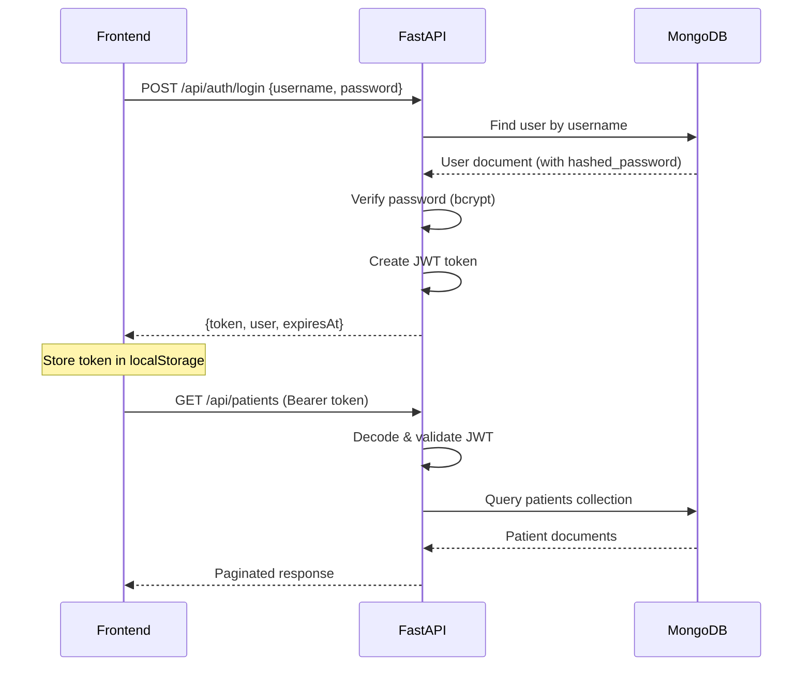

# 🏥 HealthPulse Backend — Complete Walkthrough

> Python + FastAPI + MongoDB backend for the HealthPulse Healthcare Automation Platform

---

## 📁 Project Structure

```
healthcare-backend/
├── .env                    # Environment variables (secrets — git-ignored)
├── .env.example            # Template for .env (safe to commit)
├── .gitignore              # Git ignore rules
├── requirements.txt        # Python dependencies
├── run.py                  # Server entry point
├── venv/                   # Python virtual environment
│
└── app/
    ├── __init__.py          # Package marker
    ├── config.py            # Settings loaded from .env via pydantic-settings
    ├── database.py          # Async MongoDB connection (Motor driver)
    ├── main.py              # FastAPI app, middleware, route registration, lifecycle
    ├── seed.py              # Seeds MongoDB with initial mock data
    │
    ├── models/              # Pydantic data models (schemas)
    │   ├── __init__.py
    │   ├── base.py          # MongoBaseModel — shared _id ↔ id mapping
    │   ├── user.py          # User, UserInDB, UserLogin, TokenResponse
    │   ├── patient.py       # Patient CRUD schemas
    │   ├── doctor.py        # Doctor CRUD schemas
    │   ├── staff.py         # Staff CRUD schemas
    │   ├── department.py    # Department CRUD schemas
    │   ├── appointment.py   # Appointment CRUD schemas
    │   ├── visit.py         # PatientVisit + Vitals schemas
    │   ├── billing.py       # Billing CRUD schemas
    │   ├── prescription.py  # Prescription CRUD schemas
    │   └── notification.py  # Notification CRUD schemas
    │
    ├── services/            # Business logic layer
    │   ├── __init__.py
    │   ├── auth.py          # JWT creation, password hashing, auth dependencies
    │   └── crud.py          # Generic CRUD service (reused by all collections)
    │
    └── routes/              # API route handlers
        ├── __init__.py
        ├── auth.py          # POST /api/auth/login, logout, validate, me
        ├── dashboard.py     # GET /api/dashboard/stats, charts
        ├── collections.py   # Factory: generates CRUD routes for any collection
        └── websocket.py     # WS /ws — real-time event broadcasting
```

---

## 🔧 Technology Stack

| Layer | Technology | Purpose |
|-------|-----------|---------|
| **Framework** | FastAPI 0.115 | Async REST API + WebSocket |
| **Database** | MongoDB (via Motor 3.7) | Document store for all healthcare data |
| **Auth** | python-jose + passlib/bcrypt | JWT tokens + secure password hashing |
| **Validation** | Pydantic v2 | Request/response schema validation |
| **Config** | pydantic-settings | Typed `.env` file loading |
| **Server** | Uvicorn | ASGI server with hot reload |

---

## 🚀 Setup & Run

### Prerequisites
- **Python 3.10+** installed
- **MongoDB** running locally on `mongodb://localhost:27017`

### Step-by-Step

```bash
# 1. Navigate to the backend directory
cd c:\HealthcareSystem\healthcare-backend

# 2. Create virtual environment (already done)
python -m venv venv

# 3. Activate virtual environment
.\venv\Scripts\activate        # Windows PowerShell
# source venv/bin/activate     # Mac/Linux

# 4. Install dependencies (already done)
pip install -r requirements.txt

# 5. Configure environment
# Edit .env file if needed (defaults work for local dev)

# 6. Start MongoDB (if not running)
# Make sure MongoDB is running on localhost:27017

# 7. Run the server
python run.py
```

> The server starts at **http://localhost:8000**  
> Swagger docs at **http://localhost:8000/docs**  
> ReDoc at **http://localhost:8000/redoc**

---

## 🔑 Environment Variables

| Variable | Default | Description |
|----------|---------|-------------|
| `APP_NAME` | HealthPulse Backend | Application display name |
| `APP_VERSION` | 1.0.0 | Semantic version |
| `DEBUG` | True | Enables hot-reload and verbose logging |
| `HOST` | 0.0.0.0 | Server bind address |
| `PORT` | 8000 | Server port |
| `MONGODB_URL` | mongodb://localhost:27017 | MongoDB connection string |
| `MONGODB_DB_NAME` | healthpulse | Database name in MongoDB |
| `JWT_SECRET_KEY` | *(change in prod!)* | Secret for signing JWT tokens |
| `JWT_ALGORITHM` | HS256 | JWT signing algorithm |
| `JWT_ACCESS_TOKEN_EXPIRE_MINUTES` | 1440 (24h) | Token expiration time |
| `CORS_ORIGINS` | localhost:5173,localhost:3000 | Allowed CORS origins (comma-separated) |
| `LOG_LEVEL` | INFO | Logging verbosity |

---

## 📡 API Endpoints

### Authentication
| Method | Endpoint | Auth | Description |
|--------|----------|------|-------------|
| `POST` | `/api/auth/login` | ❌ | Login with username/password, returns JWT |
| `POST` | `/api/auth/logout` | ✅ | Invalidate session |
| `GET` | `/api/auth/validate` | ✅ | Validate current token |
| `GET` | `/api/auth/me` | ✅ | Get current user profile |
| `GET` | `/api/auth/login-history` | ✅ | Get recent login log |

### Dashboard
| Method | Endpoint | Auth | Description |
|--------|----------|------|-------------|
| `GET` | `/api/dashboard/stats` | ✅ | Aggregated dashboard statistics |
| `GET` | `/api/dashboard/charts` | ✅ | Chart data for visualizations |

### CRUD Collections (same pattern for each)
Each collection has these endpoints:

| Method | Endpoint | Description |
|--------|----------|-------------|
| `GET` | `/api/{collection}?page=1&pageSize=50` | Paginated list |
| `GET` | `/api/{collection}/search?q=term` | Full-text search |
| `GET` | `/api/{collection}/{id}` | Get by ID |
| `POST` | `/api/{collection}` | Create new record |
| `PUT` | `/api/{collection}/{id}` | Update record |
| `DELETE` | `/api/{collection}/{id}` | Delete record |

**Available collections:**
`patients`, `doctors`, `staff`, `departments`, `appointments`, `visits`, `billing`, `prescriptions`, `notifications`

### WebSocket
| Protocol | Endpoint | Description |
|----------|----------|-------------|
| `WS` | `/ws` | Real-time hospital event feed |

### Health
| Method | Endpoint | Description |
|--------|----------|-------------|
| `GET` | `/` | Basic health check |
| `GET` | `/api/health` | Detailed health + DB status |

---

## 🔐 Authentication Flow



### Default Login Credentials
| Username | Password | Role |
|----------|----------|------|
| `admin` | `admin123` | Admin |
| `doctor` | `doctor123` | Doctor |
| `staff` | `staff123` | Staff |

---

## 🗄️ Database Schema

The MongoDB database `healthpulse` contains these collections:

| Collection | Document Count | ID Pattern | Key Fields |
|-----------|---------------|------------|------------|
| `users` | 3 | U001, U002... | username, hashed_password, role |
| `patients` | 8 | P001, P002... | name, age, gender, bloodGroup |
| `doctors` | 6 | D001, D002... | name, specialization, department |
| `staff` | 5 | S001, S002... | name, role, department |
| `departments` | 7 | DEP001... | name, head, staffCount |
| `appointments` | 6 | APT001... | patientName, doctorName, date, status |
| `visits` | 4 | V001, V002... | diagnosis, treatment, vitals |
| `billing` | 5 | B001, B002... | amount, total, paymentMethod, status |
| `prescriptions` | 4 | RX001... | medications, dosage, instructions |
| `notifications` | 6 | N001, N002... | title, message, type, read |
| `login_logs` | dynamic | auto | userId, timestamp, ip |

---

## 🏗️ Architecture Decisions

### 1. Generic CRUD Service
Instead of writing separate service classes for each entity, a single `CRUDService` class handles all CRUD operations for any collection. This eliminates ~90% of boilerplate code.

### 2. Router Factory
`create_collection_router()` generates a complete set of REST endpoints for any MongoDB collection. Adding a new entity requires just one line in `main.py`.

### 3. Response Format Compatibility
All API responses match the frontend's `ApiResponse<T>` interface:
```json
{
  "data": { ... },
  "status": 200,
  "message": "Success",
  "timestamp": 1712345678000,
  "requestId": "req_1712345678"
}
```

### 4. Auto-Seeding
On first startup, if collections are empty, the seeder populates them with the exact same mock data the frontend uses — ensuring zero-friction migration from the simulated API to the real backend.

### 5. WebSocket Events
The backend replicates the frontend's `WebSocketSimulator` behavior — broadcasting random hospital events every 4-16 seconds to all connected clients.

---

## 🔄 Frontend Integration Guide

To connect the React frontend to this backend, you would update the frontend's `api.ts` to make real HTTP calls instead of using the simulated `RealtimeDatabase`. The API response format is already compatible.

**Key changes needed in frontend:**
1. Replace `localStorage` API simulation with `fetch()` calls to `http://localhost:8000/api/*`
2. Replace WebSocket simulator with real `WebSocket('ws://localhost:8000/ws')`
3. Store JWT token from login response and send as `Authorization: Bearer <token>` header

---

## 🧪 Quick Test

Once the server is running, test with:

```bash
# Health check
curl http://localhost:8000/

# Login
curl -X POST http://localhost:8000/api/auth/login \
  -H "Content-Type: application/json" \
  -d '{"username":"admin","password":"admin123"}'

# Get patients (use token from login response)
curl http://localhost:8000/api/patients \
  -H "Authorization: Bearer YOUR_TOKEN_HERE"
```

Or just visit **http://localhost:8000/docs** for the interactive Swagger UI.
